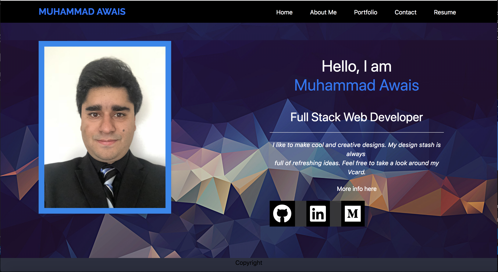

# New-Portfolio

This portfolio is my old version, please click on the link below to be taken to my updated portfolio. 
[New-Portfolio](https://mawais54013.github.io/MAwais/);

This is an upgraded version of Portfolio created with UIkit and Bootstrap while also including HTML and CSS as the base language for this program. 

[Portfolio](https://mawais54013.github.io/New-Portfolio/)

# Images


This is the main page of my porfolio which has links to my other accounts in Github, LinkedIn, and Medium blog. Along with tabs to other information about myself and the portfolio of my projects. 

# Code Snippets
1) The code belows is one of many new features to this portfolio in which the icons from Font Awesome are used to go directly to websites. These are organized into a horizontal list with each combined with links. 
```
<div class="col-md">
    <div class="uk-card uk-card uk-card-body uk-width-1-1@m" id="area2">
        <h1 id="head3"><span id="span1">Hello, I am</span><br>Muhammad Awais</h1>
        <h2 id="p1">Full Stack Web Developer</h2>
        <hr>
        <p class="medium" id="p1"><i>I like to make cool and creative designs. My design stash is always <br>full of refreshing ideas. Feel free to take a look around my Vcard.</i></p>
        <p id="p1">More info here</p>
        
        <ul class="social">
            <li id="list1"><a href="https://github.com/mawais54013"><i class="fab fa-github fa-3x"></i></a></li>
            <li id="list2"><a href="https://www.linkedin.com/in/-muhammad-awais/"><i class="fab fa-linkedin fa-3x"></i></a></li>
            <li id="list2"><a href="https://medium.com/@mawais54013"><i class="fab fa-medium fa-3x"></i></a></li>
        </ul>
    </div>
</div>
```

# Author 
[Muhammad Awais](https://github.com/mawais54013/Bootstrap-Portfolio)
